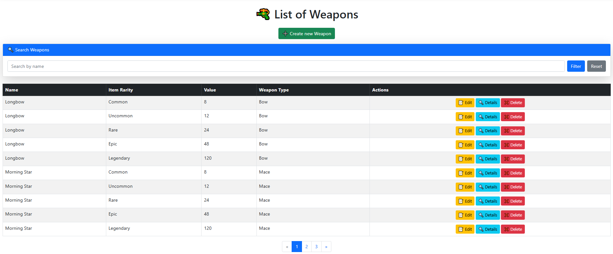

# Prosta aplikacja webowa do zarządzania wiki/fandomem gry RPG
A simple web app to manage a wiki/fandom for an RPG game

---

## Opis / Description

PL:  
Prosta aplikacja webowa umożliwiająca zarządzanie encyklopedią świata gry RPG, w tym przedmiotami, postaciami oraz interakcjami użytkowników.
Mini-projekt wykonany na zaliczenie laboratoriów z programowania zaawansowanego.  

EN:  
A simple web application for managing an RPG game encyclopedia, including items, characters, and user interactions.
Mini-project developed as a requirement for passing the advanced programming lab course.

---

## ✅ Funkcjonalności (PL)

- CRUD dla obiektów broni  
  Dodawanie, edytowanie, usuwanie, przeglądanie broni.

- CRUD dla obiektów zbroi  
  Zarządzanie zbrojami.

- CRUD dla obiektów przedmiotów pozostałych  
  Pełna obsługa innych przedmiotów.

- Stronicowanie dla obiektów: broni, zbroi, przedmiotów pozostałych  
  Dzielenie listy przedmiotów na strony.

- Wyszukiwarka przedmiotów po nazwie  
  Wyszukiwanie po nazwie wśród broni, zbroi i innych przedmiotów.

- Sortowanie po typie w danym przedmiocie  
  Sortowanie według kategorii w obrębie wybranego typu przedmiotu.

- Wyświetlanie w dashboardzie statystyk aplikacji  
  Pokazywanie liczby i rodzaju obiektów w systemie.

- Rejestrowanie użytkowników  
  Możliwość tworzenia kont.

- Logowanie użytkowników  
  Autoryzacja użytkowników.

- Dodawanie nowej postaci przez użytkownika  
  Użytkownik może dodać postać; zgłoszenie trafia do admina do weryfikacji.

- Sortowanie postaci po typie  
  Sortowanie postaci według przypisanego typu.

- Live Chat dla zalogowanych użytkowników  
  Czat w czasie rzeczywistym dla użytkowników z kontem.

- Zarządzanie typami postaci w panelu admina  
  Admin może tworzyć i edytować typy/kategorie postaci.

- Pełen CRUD dla typów postaci  
  Dodawanie, edytowanie, usuwanie, przeglądanie typów postaci.

- Panel do przeglądania zgłoszonych nowych postaci  
  Admin może przejrzeć zgłoszenie, poprawić je lub zaakceptować.

---

## ✅ Features (EN)

- CRUD for weapons  
  Create, read, update, delete weapons.

- CRUD for armors  
  Manage armors.

- CRUD for other items  
  Full support for other items.

- Pagination for weapons, armors, and other items  
  Split item lists into pages.

- Search by item name  
  Search by name among weapons, armors, and other items.

- Sorting by type within selected item  
  Sort by category within selected item type.

- Dashboard statistics display  
  Show the number and types of objects in the system.

- User registration  
  Ability to create accounts.

- User login  
  User authentication.

- User character submission  
  Users can submit a new character; the submission is sent to the admin for review.

- Sorting characters by type  
  Sort characters by their assigned type.

- Live chat for logged-in users  
  Real-time chat for logged-in users.

- Managing character types in the admin panel  
  The admin can create and edit character types/categories.

- Full CRUD for character types  
  Add, edit, delete, and view character types.

- Panel for reviewing submitted characters  
  The admin can review, edit, or approve submitted characters.

## Pokaz dzialania / Showcase

  
**PL:** Panel logowania.  
**EN:** Login panel.

  
**PL:** Panel rejestracji.  
**EN:** Registration panel.

  
**PL:** Lista dostępnej broni.  
**EN:** List of available weapons.

  
**PL:** Formularz edycji przedmiotu.  
**EN:** Edit item form.

  
**PL:** Czat na żywo dla użytkowników.  
**EN:** Live chat for users.
